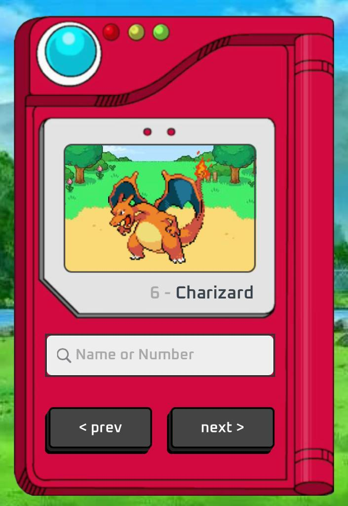

<h1 align="center"> Pokexe </h1>

Uma pokedex feita aparti da API publica de pokemon a PokéAPI 

  <a href="#-descrição">Descrição</a>&nbsp;&nbsp;&nbsp;|&nbsp;&nbsp;&nbsp;
  <a href="#-tecnologias">Tecnologias</a>&nbsp;&nbsp;&nbsp;|&nbsp;&nbsp;&nbsp;
  <a href="#-projeto">Projeto</a>&nbsp;&nbsp;&nbsp;|&nbsp;&nbsp;&nbsp;
  <a href="#-licença">Licença</a>&nbsp;&nbsp;&nbsp;|&nbsp;&nbsp;&nbsp;

  

 

  

# Descrição

A Pokedex é uma aplicação web desenvolvida com o objetivo de proporcionar uma experiência completa de pesquisa e exploração do vasto universo dos Pokémons. Utilizando a API pública do Pokemon, conhecida como PokeAPI, a Pokedex permite que o usuario encontre o Pokémon específico, buscando por seus nomes ou números de identificação.

## 🚀 Tecnologias

Esse projeto foi desenvolvido com as seguintes tecnologias:

- HTML e CSS
- JavaScrpit
- API
- Git e Github

## 💻 Projeto

 
  O projeto foi desenvolvido para por em pratica meus estudos sobre requisições HTTP, API. 
  Definitivamente um dos projetos que mais gostei de fazer :)
  

  
- [Acesse o projeto finalizado, online](https://lucca7r.github.io/pokedex/)

## 👋 Licença

[MIT](https://choosealicense.com/licenses/mit/)
